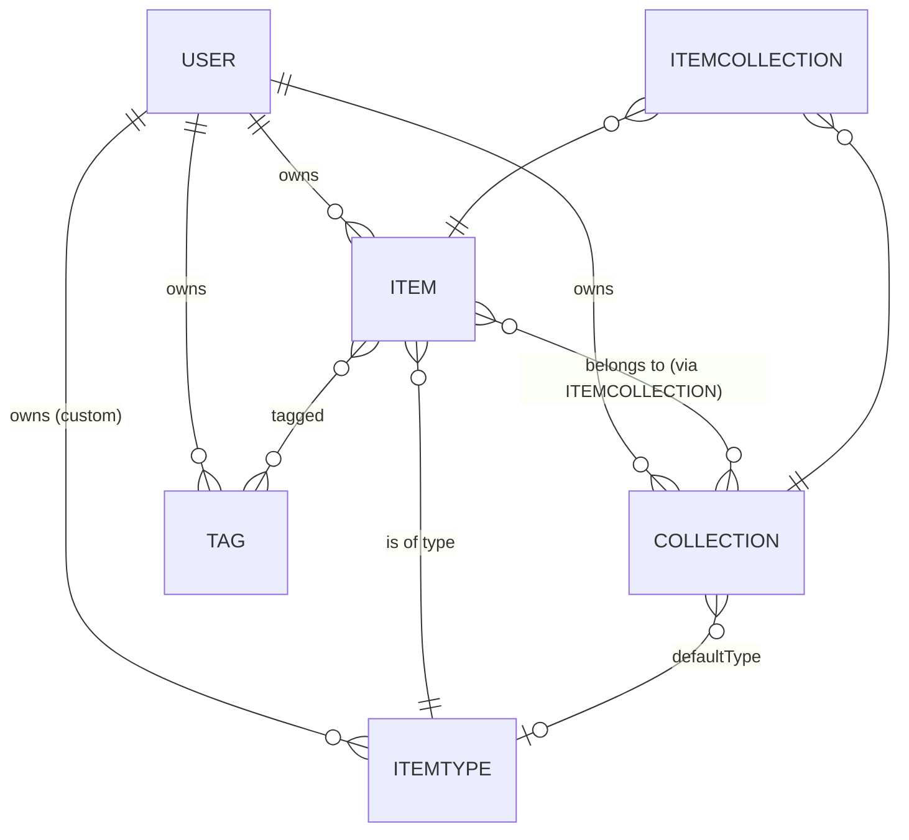

# 📦 DevStash — Project Overview

> One fast, searchable, AI-enhanced hub for everything a developer stashes away.

---

## 🎯 The Problem

Developers keep their essentials scattered across a dozen places:

| What | Where it usually lives |
|---|---|
| Code snippets | VS Code, Notion, random gists |
| AI prompts | ChatGPT/Claude chat histories |
| Context files | Buried inside project folders |
| Useful links | Browser bookmarks (that no one ever opens) |
| Docs | Random folders on disk |
| Terminal commands | `.txt` files and bash history |
| Project templates | GitHub gists |

This fragmentation causes **context switching, lost knowledge, and inconsistent workflows**.

**DevStash** solves this with a single, fast, searchable, AI-enhanced hub for all developer knowledge and resources.

---

## 👥 Target Users

- **Everyday Developer** — Needs a fast way to grab snippets, prompts, commands, and links.
- **AI-first Developer** — Saves prompts, contexts, workflows, and system messages.
- **Content Creator / Educator** — Stores code blocks, explanations, and course notes.
- **Full-stack Builder** — Collects patterns, boilerplates, and API examples.

---

## ✨ Features

### A. Items & Item Types

Items are the atomic unit of DevStash. Each item has a **type** that determines how it's stored and displayed.

**System types (non-editable):**

| Type | Tier | Content Type | Icon | Color |
|---|---|---|---|---|
| Snippet | Free | text | `Code` | `#3b82f6` (blue) |
| Prompt | Free | text | `Sparkles` | `#8b5cf6` (purple) |
| Command | Free | text | `Terminal` | `#f97316` (orange) |
| Note | Free | text | `StickyNote` | `#fde047` (yellow) |
| Link | Free | url | `Link` | `#10b981` (emerald) |
| File | **Pro** | file | `File` | `#6b7280` (gray) |
| Image | **Pro** | file | `Image` | `#ec4899` (pink) |

Users can create **custom types** in the future (Pro feature).

- Items are quick to create and view inside a **drawer UI**.
- Type-scoped URLs: `/items/snippets`, `/items/prompts`, etc.

### B. Collections

Collections group related items and **support many-to-many relationships** — one item can belong to multiple collections (e.g., a React snippet in both "React Patterns" and "Interview Prep").

Examples: `React Patterns`, `Context Files`, `Python Snippets`, `Onboarding Prompts`.

### C. Search

Powerful search across **content, tags, titles, and types**. Fast, indexed, keyboard-first.

### D. Authentication

- Email + password
- GitHub OAuth

Powered by **NextAuth v5**.

### E. Quality-of-Life Features

- Favorite items and collections
- Pin items to top
- Recently used view
- Import code from a file
- Markdown editor for text types
- File upload for file/image types
- Data export (JSON / ZIP)
- Dark mode by default (light mode available)
- Add/remove items across multiple collections
- View which collections an item belongs to

### F. AI Features (Pro only)

Powered by **OpenAI `gpt-5-nano`**.

- 🏷️ **Auto-tag suggestions** — Smart tags based on content
- 📝 **AI Summaries** — TL;DR for long items
- 💡 **Explain This Code** — Inline code explanations
- ⚡ **Prompt Optimizer** — Refine prompts for better AI output

---

## 🗄️ Data Model

### Entity Relationship Diagram



### Prisma Schema (Draft)

> ⚠️ Draft — not final. Refine as the app evolves.

```prisma
// schema.prisma

generator client {
  provider = "prisma-client-js"
}

datasource db {
  provider = "postgresql"
  url      = env("DATABASE_URL")
}

// ---------- USER ----------
// Extends NextAuth's base User model

model User {
  id                    String   @id @default(cuid())
  email                 String   @unique
  name                  String?
  image                 String?
  emailVerified         DateTime?

  // Billing / tier
  isPro                 Boolean  @default(false)
  stripeCustomerId      String?  @unique
  stripeSubscriptionId  String?  @unique

  // Relations
  items        Item[]
  collections  Collection[]
  itemTypes    ItemType[]   // Custom types (null for system types)
  tags         Tag[]
  accounts     Account[]
  sessions     Session[]

  createdAt DateTime @default(now())
  updatedAt DateTime @updatedAt
}

// ---------- ITEM TYPE ----------
// System types seeded at migration; users can add custom ones (Pro).

model ItemType {
  id        String   @id @default(cuid())
  name      String   // "snippet", "prompt", "command", etc.
  icon      String   // Lucide icon name
  color     String   // Hex color
  isSystem  Boolean  @default(false)

  userId    String?  // null for system types
  user      User?    @relation(fields: [userId], references: [id], onDelete: Cascade)

  items               Item[]
  defaultForCollections Collection[] @relation("CollectionDefaultType")

  @@unique([userId, name])
  @@index([userId])
}

// ---------- ITEM ----------

enum ContentType {
  text
  file
  url
}

model Item {
  id          String       @id @default(cuid())
  title       String
  description String?
  contentType ContentType

  // Text payload (null for file/url items)
  content     String?      @db.Text

  // File payload (null for text/url items)
  fileUrl     String?      // Cloudflare R2 URL
  fileName    String?
  fileSize    Int?         // bytes

  // Link payload (null for text/file items)
  url         String?

  // Flags
  isFavorite  Boolean      @default(false)
  isPinned    Boolean      @default(false)

  // Code metadata
  language    String?      // e.g., "typescript", "python"

  // Relations
  userId      String
  user        User         @relation(fields: [userId], references: [id], onDelete: Cascade)

  itemTypeId  String
  itemType    ItemType     @relation(fields: [itemTypeId], references: [id])

  tags        Tag[]
  collections ItemCollection[]

  createdAt   DateTime     @default(now())
  updatedAt   DateTime     @updatedAt

  @@index([userId])
  @@index([itemTypeId])
  @@index([userId, isPinned])
}

// ---------- COLLECTION ----------

model Collection {
  id             String   @id @default(cuid())
  name           String
  description    String?
  isFavorite     Boolean  @default(false)

  // Used when a collection is empty, to suggest a type for new items
  defaultTypeId  String?
  defaultType    ItemType? @relation("CollectionDefaultType", fields: [defaultTypeId], references: [id])

  userId         String
  user           User     @relation(fields: [userId], references: [id], onDelete: Cascade)

  items          ItemCollection[]

  createdAt      DateTime @default(now())
  updatedAt      DateTime @updatedAt

  @@index([userId])
}

// ---------- ITEM <-> COLLECTION (join table) ----------

model ItemCollection {
  itemId       String
  collectionId String
  addedAt      DateTime   @default(now())

  item         Item       @relation(fields: [itemId], references: [id], onDelete: Cascade)
  collection   Collection @relation(fields: [collectionId], references: [id], onDelete: Cascade)

  @@id([itemId, collectionId])
  @@index([collectionId])
}

// ---------- TAG ----------

model Tag {
  id     String @id @default(cuid())
  name   String

  userId String
  user   User   @relation(fields: [userId], references: [id], onDelete: Cascade)

  items  Item[]

  @@unique([userId, name])
  @@index([userId])
}
```

> 🚨 **Migration Policy:** Never use `prisma db push` or directly mutate the database structure. **Always use migrations** — run in dev first, then promoted to prod.

---

## 🛠️ Tech Stack

| Layer | Choice | Notes |
|---|---|---|
| Framework | **Next.js 16 / React 19** | SSR pages + dynamic components |
| Language | **TypeScript** | Type safety end-to-end |
| API | Next.js API routes | Items, uploads, AI calls |
| Database | **Neon (PostgreSQL)** | Serverless Postgres |
| ORM | **Prisma 7** | Migrations only — no `db push` |
| Cache | Redis *(maybe)* | TBD based on load |
| File Storage | **Cloudflare R2** | For file/image uploads |
| Auth | **NextAuth v5** | Email/password + GitHub OAuth |
| AI | **OpenAI `gpt-5-nano`** | Tagging, summaries, explain, optimize |
| Styling | **Tailwind CSS v4** + **shadcn/ui** | Component library |
| Payments | **Stripe** | Subscriptions |

> 📚 Always fetch the **latest Prisma 7 docs** before writing schema or migrations.

---

## 💰 Monetization — Freemium

| | Free | Pro ($8/mo or $72/yr) |
|---|---|---|
| Items | 50 total | Unlimited |
| Collections | 3 | Unlimited |
| System types | All except file/image | All |
| File & image uploads | ❌ | ✅ |
| Search | Basic | Basic |
| Custom types | ❌ | ✅ *(coming later)* |
| AI auto-tagging | ❌ | ✅ |
| AI code explanation | ❌ | ✅ |
| AI prompt optimizer | ❌ | ✅ |
| Data export (JSON/ZIP) | ❌ | ✅ |
| Priority support | ❌ | ✅ |

> 🧪 **During development:** all users have access to everything. Gate-checks and Stripe wiring scaffold now; enforcement flips on at launch.

---

## 🎨 UI / UX

### Design Principles

- Modern, minimal, developer-focused
- **Dark mode default**, light mode optional
- Clean typography, generous whitespace
- Subtle borders and shadows
- Syntax highlighting for codeblocks
- **References:** Notion, Linear, Raycast

### Layout

- **Sidebar + main content** (collapsible sidebar)
- **Sidebar contents:**
  - Item types (Snippets, Prompts, Commands, Notes, Links, Files, Images)
  - Latest / favorite collections
- **Main area:**
  - Grid of collection cards — **background color** reflects the dominant item type in that collection
  - Items appear as cards with **border color** matching their type
- **Item detail:** opens in a quick-access **drawer** (not a full-page nav)

### Responsive

- Desktop-first, fully mobile-usable
- Sidebar collapses into a drawer on mobile

### Micro-interactions

- Smooth transitions
- Hover states on cards
- Toast notifications for user actions
- Loading skeletons (not spinners)

---

## 🧭 Suggested Build Order

1. **Foundation** — Next.js + Prisma + Neon, base schema & initial migration, seed system `ItemType`s
2. **Auth** — NextAuth v5 with credentials + GitHub
3. **Core CRUD** — Items, Collections, Tags; drawer UX; markdown editor
4. **Search** — Content/title/tag/type search
5. **File uploads** — Cloudflare R2 integration (behind Pro flag, unlocked in dev)
6. **AI features** — OpenAI `gpt-5-nano` integration (auto-tag → summaries → explain → optimizer)
7. **Billing** — Stripe subscriptions, `isPro` enforcement
8. **Polish** — Dark/light, micro-interactions, mobile, export

---

## 📝 Notes & Open Questions

- Redis caching: defer until there's a measured need.
- Custom item types: shipped post-launch for Pro.
- Consider full-text search via Postgres `tsvector` before reaching for a dedicated search service.
- Decide whether `Tag` should be global (shared across users) or per-user — schema currently scopes tags per user, which is the safer default.
